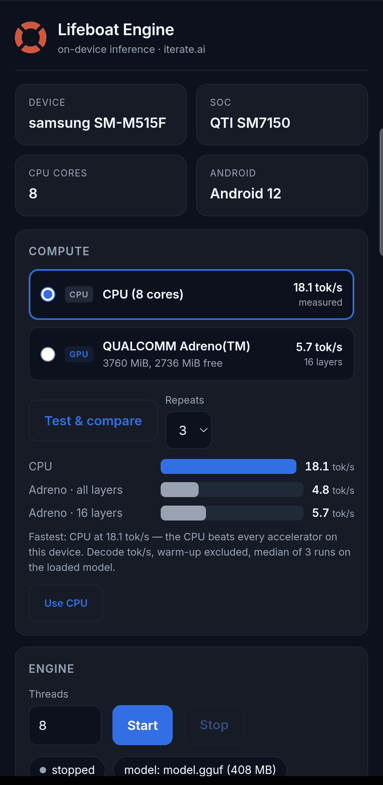

# Android: CPU vs Adreno GPU on a real handset

Raw data in [`result.json`](result.json). Harness: `packaging/android/bench-android.sh`.

| | |
|---|---|
| Device | Samsung SM-M515F (Galaxy M51) |
| SoC | Snapdragon 730G (SM7150) — Kryo 470, **Adreno 618**, Hexagon 688 |
| Android | 12 |
| Engine | llama.cpp GGUF engine, `arm64-v8a`, backends dispatched at runtime |
| Workload | 64 tokens, temperature 0, foreground app, warm-up excluded, **median of 3** |

## Choosing from the numbers, on the device

The console lists every device the engine can reach and measures them against
each other, because no built-in rule generalises across the Android range.
"Test & compare" runs the CPU, each accelerator at full offload, and a partial
CPU/GPU split, then charts them and offers the winner in one tap.



Both facts in that chart are ones a rule of thumb would get wrong: the CPU wins
outright, and the *partial* split beats handing the GPU everything.

## The headline: the GPU is 4.7x SLOWER than the CPU

Qwen2.5-0.5B-Instruct **Q4_0**. Two independent runs, hours apart:

| Arm | Prefill | Decode | Samples | Spread |
|---|---|---|---|---|
| CPU `-ngl 0` (run 1) | 86.41 | **18.11 tok/s** | 18.19, 17.57, 18.11 | 3% |
| GPU `-ngl 99` (run 1) | 18.49 | **3.88 tok/s** | 3.88, 3.88, 3.88 | 0% |
| CPU `-ngl 0` (run 2) | 76.40 | **18.00 tok/s** | 17.54, 18.21, 18.00 | 4% |
| GPU `-ngl 99` (run 2) | 18.65 | **3.89 tok/s** | 3.89, 3.88, 3.90 | 1% |

Both runs agree to within 1%. This is a measurement, not thermal noise.

The reason is not that the GPU is broken — it works fine. llama.cpp's OpenCL backend is tuned for **A7X / A8X / X1E / X2E**; Adreno 6xx is supported but untuned, and a low-end mobile GPU also shares memory bandwidth with the CPU it is supposed to be relieving.

**So the app's default was wrong.** It shipped `-ngl 99`. `Bridge.defaultNgl()` now demotes Adreno 6xx to CPU, and serving with no explicit `-ngl` went from **3.91 → 17.22 tok/s** (4.4x). The rule is deliberately narrow: only the generation actually measured is demoted, an unknown or unreadable GPU keeps full offload, and an explicit `-ngl` always wins.

## Quantization changes the GPU result three-fold

Same device, same model, weights that are predominantly **Q5_0** instead of Q4_0:

| Arm | Prefill | Decode |
|---|---|---|
| CPU | 35.87 | 13.96 tok/s |
| GPU | 8.32 | **1.29 tok/s** |

1.29 against Q4_0's 3.89. The Adreno path is written around Q4_0 and other formats take a generic route. **Never compare two mobile GPU figures without checking the quantization** — otherwise the number is measuring the format, not the device.

## This GPU was previously reported as not working. That was our bug — three of them

Each was independently sufficient, and each was silent, because ggml swallows backend load errors and then reports `no usable GPU found, --gpu-layers option will be ignored` — which reads as a verdict about the hardware.

1. **An OpenCL 3.0 symbol against a 2.0 driver.** `libggml-opencl.so` referenced `clCreateBufferWithProperties`; the Adreno 618 driver is OpenCL 2.0, so `dlopen` failed with `cannot locate symbol`. Fixed by building with `-DGGML_OPENCL_TARGET_VERSION=200`.
2. **The vendor driver was not on the library path.** `libOpenCL.so` lives in `/vendor/lib64`, which is not the app's own lib dir: `library "libOpenCL.so" not found ... in namespace (default)`. Being listed in `/vendor/etc/public.libraries.txt` makes a library *permitted*, not *findable*.
3. **An upstream kernel omits a pragma.** `flash_attn_repack.cl` declares three `__write_only image3d_t` parameters and enables only `cl_khr_fp16`. Writing a 3D image is **core** in OpenCL 3.0 and an **extension** in 2.0, so on a 3.0 driver the omission is invisible and on a 2.0 driver every kernel in the file fails to compile at model load, taking the whole backend down. The build now adds `#pragma OPENCL EXTENSION cl_khr_3d_image_writes : enable`.

(1) and (3) are the same mistake twice: the backend is written against OpenCL 3.0 while these devices are 2.0.

With all three fixed the device enumerates:

```
Available devices:
  GPUOpenCL: QUALCOMM Adreno(TM) (3760 MiB, 2736 MiB free)
```

## A fourth bug was in the benchmark, and it hid the fix

With the GPU working, the harness still reported `GPU FAILED (no timings)`.

While the model loads, `/health` answers **503** `{"error":{"message":"Loading model"}}` — and `curl -s -o /dev/null` **exits 0 on a 503**, because without `-f` curl reports transport success, not HTTP success. The readiness loop broke on the first reply of any kind, slept 3s, and measured a server still loading weights. The CPU arm loads fast enough to survive that; the GPU arm pays shader compilation and does not — so the only arm the bug could break was the one the benchmark exists to measure, and it presented as a hardware failure.

**Readiness is the status code, not whether curl ran.** `curl -fs`.

## The Hexagon NPU: not "too old", not reachable

The datasheet answer — Hexagon 688 is v66, the backend needs v73+ — is true and is not the binding constraint. Measured on the device:

| Probe | Result |
|---|---|
| `/dev/cdsprpc-smd` (the compute-DSP RPC channel the backend uses) | **absent** — `find /dev -name '*cdsprpc*'` returns 0 |
| fastrpc domains the kernel registered | `adsprpc-smd`, `adsprpc-smd-secure` — the **audio** DSP only |
| HTP/HMX skels in `/vendor/lib/rfsa/adsp/` | **0 of 18** |
| Skels llama.cpp builds | `v73`, `v75`, `v79` — and it caps a lower arch at v73, i.e. it would load a skel this DSP cannot run |

The cDSP subsystem exists (`subsys_cdsp`) and simply is not exposed to userspace here. The dedicated NPU block (`/dev/msm_npu`) is mode `644 system:system` under SELinux label `vendor_npu_device`, so an app cannot open it for ioctl, and it speaks Qualcomm's proprietary SNPE/QNN interface rather than anything llama.cpp implements.

## Reproducing

```sh
MODEL=/path/to/qwen2.5-0.5b-instruct-q4_0.gguf \
APK=/path/to/lifeboat-engine.apk \
REPEATS=3 \
  packaging/android/bench-android.sh
```

Three rules the harness enforces, each learned by getting it wrong:

* **State `-ngl` explicitly on both arms.** Unset does not mean CPU; it means whatever the build's auto-offload policy decides.
* **Measure in the foreground app.** A process launched over `adb shell` lands in `/dev/cpuset/background/cpus` (`0-3`) and is confined to the little cores — worth ~1.3x, and `taskset` does not rescue it.
* **Repeats are not optional.** One handset returned 1.86, 7.30 and 11.31 tok/s on the identical CPU arm — a 6x spread from thermal management alone. The script reports the median, prints every sample, and refuses to publish anything over 25% spread.
